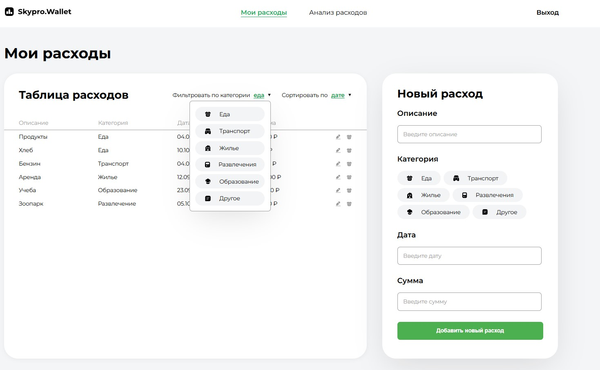
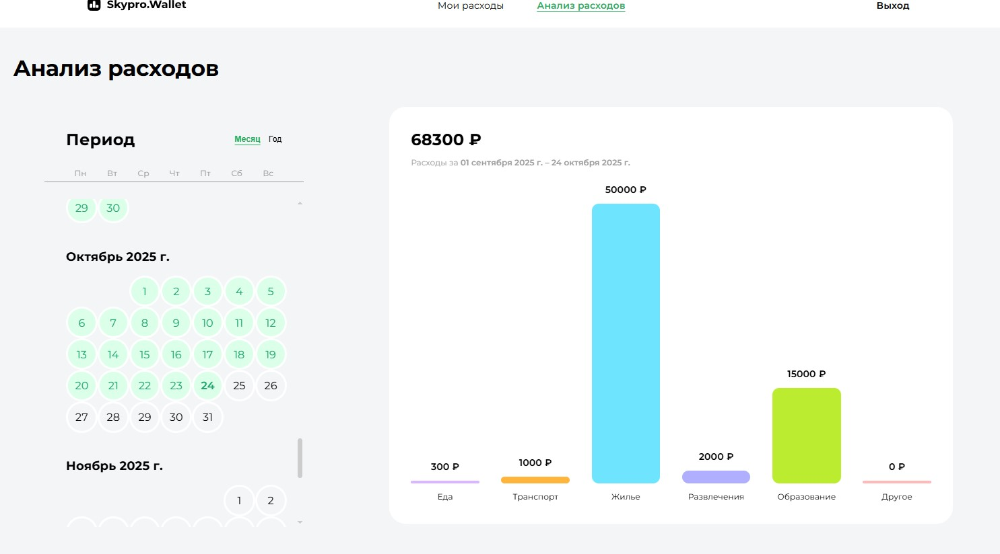

💰 SkyproWallet

SkyproWallet is a team project developed as part of a multi-sprint collaboration. It’s a personal finance management app built with React, Context API, and Styled Components, featuring responsive design and an intuitive user experience.

🚀 Project Overview

The goal of the project was to create a modern, functional web application that helps users manage their finances — from initial layout to full business logic integration and final polishing.

The work was divided into three sprints, following an agile development process similar to real-world product teams.

🏁 Development Process
Sprint 1 — Project Setup & Basic Layout
Goal: Build the project’s foundation and create a fully designed set of core pages.
Result:
Project structure initialized
Main pages fully designed and styled
Technical and visual base prepared for future development

Sprint 2 — API Integration & Business Logic
Goal: Implement core functionality and connect the app to the backend.
Result:
Data fetching and state management via Context API
Key user interaction flows implemented
API integrated for real user data and operations

Sprint 3 — Responsiveness & Final Polish
Goal: Deliver a complete, fully responsive, and production-ready application.
Result:
Adaptive layout for desktop, tablet, and mobile
UI/UX refinements and performance improvements
Toast notifications for user feedback
Final testing and preparation for presentation

⚙️ Tech Stack

React — UI library
Context API — Global state management
Styled Components — Component-based styling
React Toastify — User notifications
HTML5 / CSS3 / JavaScript (ES6+)

👥 Team Collaboration

The project was developed in a team setting with weekly sprint reviews and cross-code reviews.
My roles included:

👩‍💻 Developer: Implemented core features and UI components

🧭 Team Lead & Project Manager:
Organized workflow and sprint planning
Managed communication and task distribution
Conducted cross-review sessions for code quality and consistency

💡 Key Features

Fully responsive design
Modular, reusable component structure
Centralized state management
Real-time feedback with toast notifications
Clean and maintainable codebase

🧩 Future Improvements

Dark mode theme
Integration with more APIs (e.g., currency exchange)
Extended analytics and data visualization

📸 Screenshots

**Main Page**

**Dashboard**

🏗️ Installation

# Clone the repository
git clone https://github.com/BNA-projects/SkyproWallet.git

# Navigate to the project folder
cd skyprowallet

# Install dependencies
npm install

# Run the project
npm run dev
